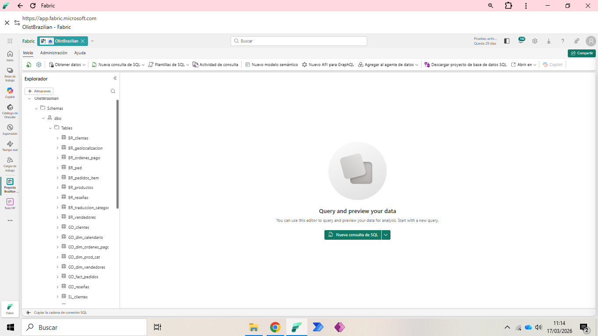
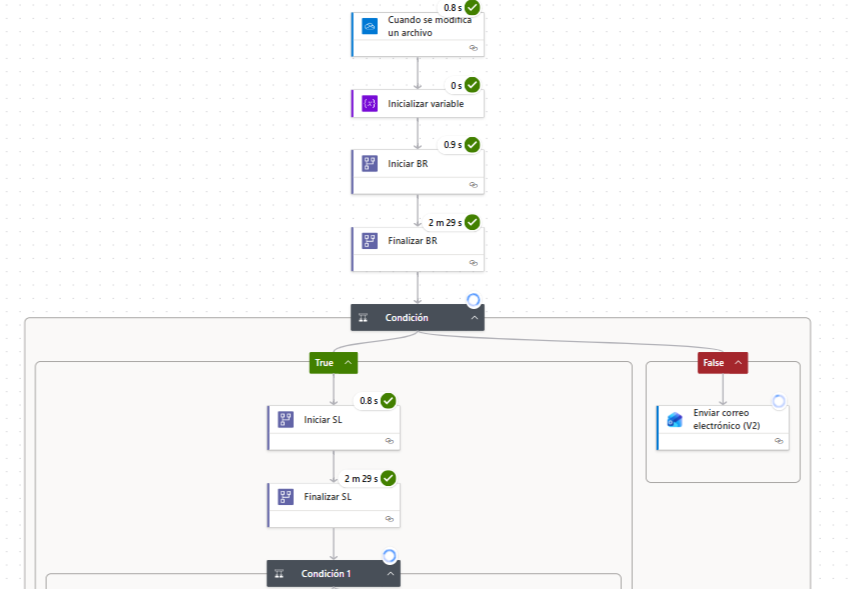
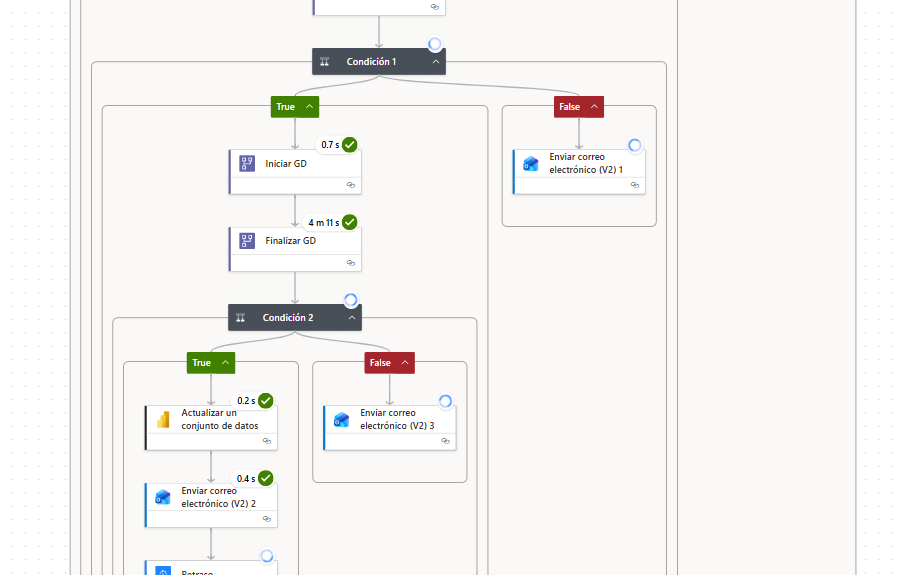
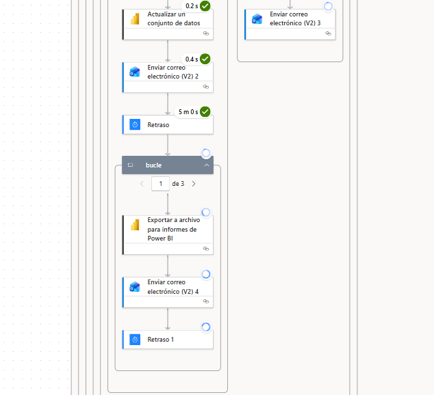
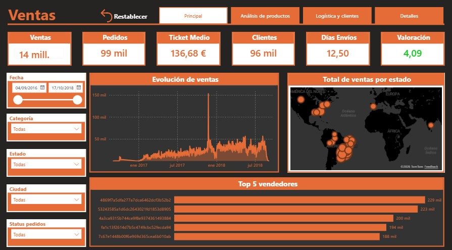

📊 End-to-End Data Engineering: Brazilian E-Commerce (Olist). Implementación integral en Microsoft Fabric

Este proyecto demuestra la construcción de una solución de datos moderna utilizando Microsoft Fabric, cubriendo desde la ingesta en un Data Warehouse hasta la transformación avanzada con PySpark y la visualización estratégica en Power BI.

🏗️ Arquitectura del Proyecto
La solución se basa en una arquitectura de Medallón, aprovechando el ecosistema SaaS de Fabric:

Ingesta (Bronze): Carga de datos crudos del ecosistema Olist (Kaggle) directamente en el Warehouse.

Transformación (Silver): Uso de Notebooks de Apache Spark para limpieza de datos, manejo de nulos y feature engineering.

Modelado (Gold): Estructuración de tablas finales en el Warehouse mediante SQL para consumo analítico.

Visualización: Reportes interactivos en Power BI conectados mediante Direct Lake para máximo rendimiento.

🛠️ Tecnologías Utilizadas
Plataforma: Microsoft Fabric (SaaS)

Almacenamiento: Data Warehouse (T-SQL)

Procesamiento: PySpark (Python 3.10)

Visualización: Power BI

Automatización: Power Automate (Notificaciones y Alertas)

🚀 Puntos Clave del Desarrollo
🐍 Ingeniería de Datos con PySpark: Para las transformaciones más complejas, opté por Notebooks de Spark en lugar de SQL tradicional. Esto permite una mayor escalabilidad y flexibilidad.

Cálculo de Métricas: Implementación de lógica para consolidar precio_total (precio + flete) con redondeo de precisión.

Manejo de Esquemas: Resolución de conflictos de nombres de columnas y tipos de datos mediante DataFrames.

🏛️ Modelado en el Warehouse
El corazón del proyecto reside en el Warehouse, donde se definieron las relaciones entre pedidos, productos y vendedores, garantizando la integridad referencial y facilitando el análisis multidimensional.

🤖 Automatización y Notificaciones (Power Automate)
Para cerrar el ciclo de vida del dato, integré Power Automate con el ecosistema de Fabric para asegurar que la información llegue a los tomadores de decisiones sin intervención manual:

Alertas de Actualización: Configuración de un flujo que se dispara al completarse la carga de datos, enviando una notificación automática por correo electrónico/Teams.

Eficiencia Operativa: Reducción del tiempo de respuesta entre la disponibilidad del dato y la acción de negocio.

📈 Insights de Negocio (Ejemplos)
A través del análisis realizado, se identificaron puntos críticos para la operación:

Logística: Identificación de las regiones de Brasil con mayores costos de envío relativo al precio del producto.

Ventas: Análisis de los periodos pico para optimizar la disponibilidad de los vendedores.

📊 Visualización y Business Intelligence

El resultado final es un tablero interactivo en **Power BI** que permite a los stakeholders monitorear la salud del negocio en tiempo real.

**Características destacadas del reporte:**
* **Direct Lake Connection:** Conexión directa al Warehouse de Fabric para asegurar datos siempre actualizados sin necesidad de refrescos manuales.
* **Análisis de Dispersión:** Identificación de la correlación entre el tiempo de entrega y la satisfacción del cliente.
* **Filtros Dinámicos:** Segmentación por categoría de producto, estado y periodo temporal.
